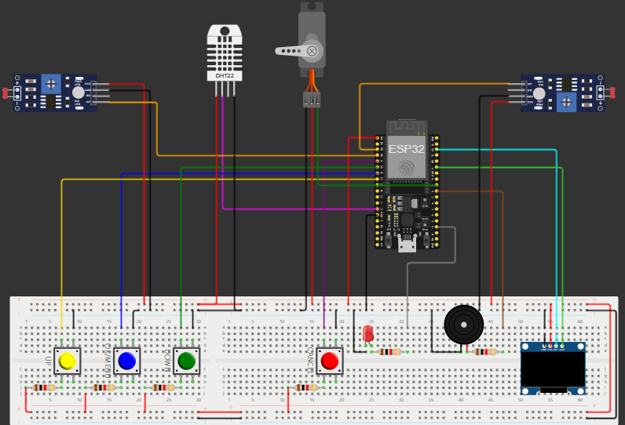

### Overview
**Enhanced Features:**
- **Expanded Time Management**: Includes advanced time zone support and improved alarm settings.
- **Enhanced Alarm System**: Features customization options, snooze functionality, and more alert mechanisms.
- **Environmental Monitoring**: Adds data logging and more detailed alerts for temperature and humidity.
- **Advanced Menu Navigation**: Offers an intuitive interface with additional settings and customization.
- **Node-RED Dashboard Integration**: Provides a visual interface for monitoring and controlling the Medibox via Node-RED.

---

### **Basic Functionalities**
The basic Medibox includes essential functionalities to manage alarms and monitor environmental conditions. Key features include:

- **Alarm System**: A simple alarm feature that can be set via buttons and displayed on an OLED screen.
- **Temperature and Humidity Monitoring**: Displays real-time temperature and humidity using a DHT22 sensor.
- **User Interface**: An OLED screen provides a visual interface to navigate through the Medibox settings, and LEDs and buzzers are used for alerts.

#### **PCB Design for Basic Functionalities**
The hardware setup for the basic functionalities has been designed using EasyEDA to ensure an organized and compact layout for the Medibox system.

1. **Basic Circuit**: 
   - A breadboard design showing the wiring for the ESP32, DHT22 sensor, OLED display, LEDs, and buzzer.
   - Includes buttons for user input.
   

2. **PCB Design**:
   - A custom PCB design created using EasyEDA for the basic Medibox system, simplifying the connections and reducing the clutter of wires.
    
---

### **Advanced Features**
The advanced Medibox system builds on the basic functionalities with added features like expanded time management, environmental monitoring, and Node-RED integration.

#### **Advanced Circuit**
The advanced version includes additional components for improved functionality:

- **Expanded Alarm System**: More customizable alarms with snooze functions.
- **Advanced Environmental Monitoring**: Enhanced logging and alerting for temperature and humidity fluctuations.
- **Node-RED Integration**: Allows remote monitoring and control via a web-based dashboard.
 

---

### **Node-RED Dashboard Integration**
The advanced Medibox project includes a Node-RED dashboard that allows you to monitor and control the system visually. Key features of the dashboard:

- **Live Monitoring**: Displays the current temperature, humidity, and alarm status.
- **Alarm Management**: Set or disable alarms directly from the dashboard.
- **Environmental Data Logging**: View trends over time for temperature and humidity.
- **Control Panel**: Offers buttons to simulate actions like stopping or snoozing the alarm.

#### **Node-RED Setup Instructions**

1. **Install Node-RED**:
   - Follow the official [Node-RED installation guide](https://nodered.org/docs/getting-started/).

2. **Import the Flow**:
   - Import the provided `flows.json` file into your Node-RED instance.

3. **Connect to ESP32**:
   - Configure your ESP32 to send data to the Node-RED server.
   - Update the Node-RED flow with the correct IP address and port if needed.

4. **Run the Dashboard**:
   - Access the Node-RED dashboard via your browser.
   - Monitor and control the Medibox from the dashboard.

---

### **How to Use**
1. **Simulation**: Open the respective project in Wokwi for either the basic or advanced Medibox version.
2. **Components Used**:
   - ESP32 microcontroller
   - OLED display
   - DHT22 sensor (for temperature and humidity)
   - Buzzer
   - LEDs
   - Push buttons
3. **Follow On-Screen Instructions**: Use the OLED display and buttons to navigate the menu, set alarms, and monitor environmental conditions.

---

### **Demonstrations**

Each folder includes a video walkthrough that explains the code and demonstrates how the system works:

- **Basic Medibox Simulation**: A video detailing the core features and functionality.

- **Advanced Medibox Simulation**: A video covering the additional features, improvements, and the Node-RED dashboard integration.

